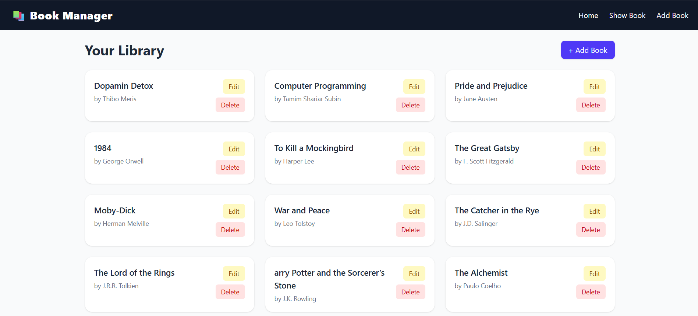

# Book Manager CRUD App

A simple, clean, and fully functional **CRUD (Create, Read, Update, Delete)** React app to manage your book collection. Easily add new books, view the list, update book details, and delete entries. The app uses Redux Toolkit for state management and React Router for navigation.

---

## Demo

Check out the live demo deployed on Netlify:  
[https://sunny-strudel-d097fb.netlify.app/](https://sunny-strudel-d097fb.netlify.app/)

---

## Screenshots

| Show Books | Edit Book | Add Book |
|------------|------------|----------|
|  |  |  |

---

## Features

- Add new books with title and author fields  
- View all books in a neat, responsive card layout  
- Edit existing book details  
- Delete unwanted books with confirmation  
- State management with Redux Toolkit slice  
- Client-side routing with React Router v6  
- User-friendly UI styled with Tailwind CSS  

---

## Tech Stack

- React.js (functional components + hooks)  
- Redux Toolkit for global state  
- React Router v6 for routing  
- Tailwind CSS for styling  
- UUID for unique book IDs  
- Deployed with Netlify  

---

## Getting Started

### Prerequisites

- Node.js and npm installed  
- Git installed  

### Installation

1. Clone the repo  
   ```bash
   git clone https://github.com/subrata-24/Small-Project-by-React.git
   cd Small-Project-by-React
   ```
2.Install dependencies
   ```bash
   npm install
   ```
3.Start the development server
   ```bash
   npm run dev
   ```
