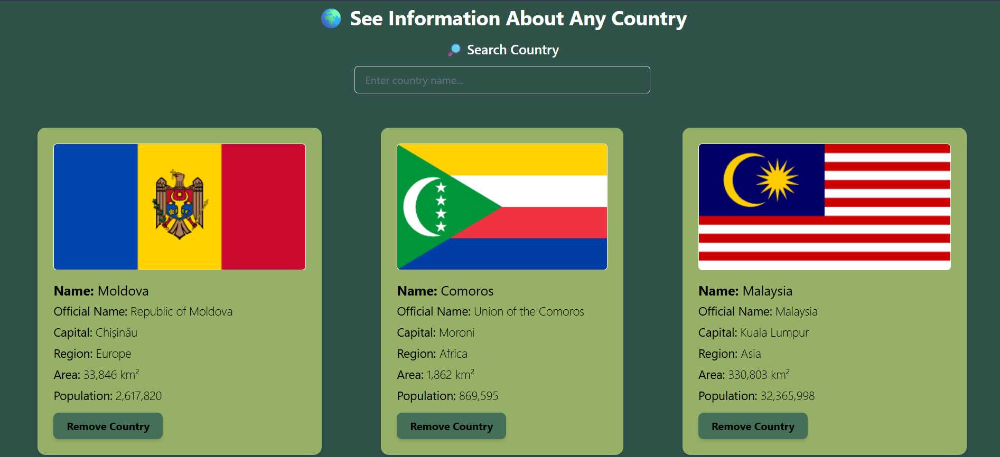

# 🌍 Country Info Explorer

Welcome to **Country Info Explorer**, a beautifully designed React application that fetches and displays information about countries from the [REST Countries API](https://restcountries.com/). Users can search for countries, view detailed information, and remove countries from the list—all in a sleek and responsive UI.

### 🔗 Live Demo
➡️ [Visit the Live App](https://elegant-bombolone-b53c4f.netlify.app/)

---

## 🖼️ Preview



---

## 🚀 Features

- ✅ Fetches live data from the REST Countries API
- 🔍 Real-time search functionality
- 🗑️ Option to remove countries from the list
- 💡 Responsive design using Tailwind CSS
- ⚡ Fast and smooth UI interactions
- 🧼 Clean component-based architecture

---

## 🛠️ Technologies Used

- **React.js** – Frontend library
- **Tailwind CSS** – For modern styling
- **REST Countries API** – Public API for country data
- **UUID** – For unique key generation

---

## 🧾 How to Run Locally

1. **Clone the repository**:
   ```bash
   git clone https://github.com/your-username/your-repo-name.git
   cd your-repo-name
   ```
2.Install dependencies:

  ```bash
  npm install
  ```
3.Start the development server:

  ```bash
  npm start
  ```
4.Open in browser:
  http://localhost:3000
